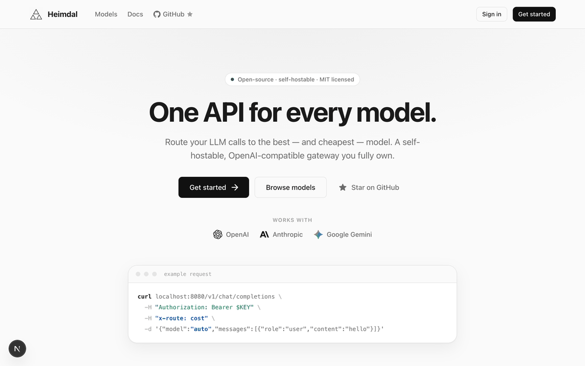
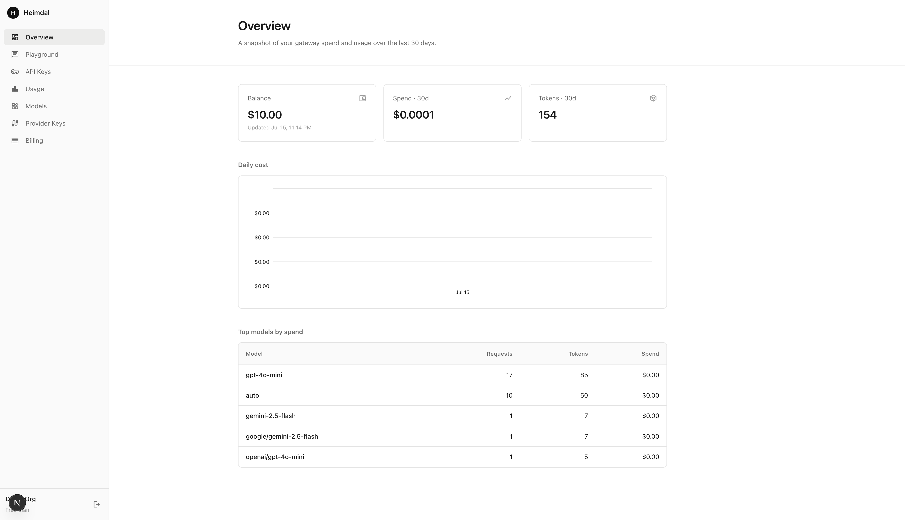

<p align="center">
  <picture>
    <source media="(prefers-color-scheme: dark)" srcset="docs/assets/logo-white.png">
    
  </picture>
</p>

<h1 align="center">Heimdal</h1>

<p align="center">
  One OpenAI-compatible API for every model — route, cache, meter, and bill across providers.<br/>
  Your own self-hosted, multi-provider LLM gateway.
</p>

<p align="center">
  
  <a href="https://github.com/nossulenko/heimdal/stargazers"></a>
  <a href="https://github.com/nossulenko/heimdal/actions/workflows/ci.yml"></a>
  <a href="LICENSE"></a>
  
  
</p>

<p align="center">
  
</p>

## What is Heimdal?

Point any OpenAI SDK at Heimdal, request a model, and it routes the call to OpenAI, Anthropic, or Google Gemini behind one unified interface — normalizing every provider's wire format (and streaming) to the OpenAI shape. It's a **clean-room, original implementation** in Go (gateway) + Next.js/MUI (dashboard).

- 🔀 **One API, every model** — an OpenAI-compatible surface over OpenAI, Anthropic & Google Gemini. Swap providers with a model string (`openai/gpt-4o-mini`) or let a logical model (`auto`) span all three.
- 🎛️ **Smart routing** — fallback, per-provider circuit breaking, provider pinning, and cost- or latency-based routing (`x-route: cost | latency`).
- ⚡ **Fast & cheap** — Redis response caching and per-org token-bucket rate limiting; async metering that never blocks the response path.
- 💳 **Billing built in** — prepaid credits in micro-USD, encrypted BYOK provider keys, and a dashboard with a public model catalog and a chat playground.

```bash
# One API for OpenAI, Anthropic & Gemini — pick a model, or let it auto-route to the cheapest:
curl localhost:8080/v1/chat/completions -H "Authorization: Bearer $KEY" \
  -H "x-route: cost" \
  -d '{"model":"auto","messages":[{"role":"user","content":"hello"}]}'
```

## Quick start

**Docker (full stack):**

```bash
cp .env.example .env    # dev defaults; change the secrets for real use
make dev                # postgres + redis + gateway (runs migrate + seed)
```

The gateway listens on `:8080`. Seeded dashboard login: `admin@example.com` / `changeme`, with a $10 starting balance.

**Local (Go + Node):**

```bash
cp .env.example .env
make infra              # just postgres + redis in Docker
make setup              # migrate + seed
make run                # gateway (go run ./cmd/gateway)

cd dashboard && pnpm install && pnpm dev   # dashboard on :3000
```

Then add a provider key under **Provider Keys**, mint an API key under **API Keys**, and call `/v1/chat/completions` like OpenAI — or try it in the **Playground**.

## Providers

Adding a provider is one `Provider` implementation — translation in, translation out. No core changes.

| Provider | Chat | Streaming | How it's called |
|---|:---:|:---:|---|
| **OpenAI** | ✅ | ✅ | native (the canonical shape) |
| **Anthropic** | ✅ | ✅ | `/v1/messages` + typed event stream, translated |
| **Google Gemini** | ✅ | ✅ | `generateContent` + `alt=sse` stream, translated |

## Dashboard

A decoupled Next.js app (`dashboard/`) styled with **MUI System** + **MUI X Charts**: overview & usage charts, API keys, encrypted provider keys, a public **model catalog**, model detail pages, and an in-app streaming **chat playground**.

<p align="center">
  
</p>

## How it works

A request flows: **auth → balance gate → rate limit → route resolution → provider call → (stream | buffer) → async meter + bill.** Fallback only happens before the first byte reaches the client; streaming is SSE, first-class. The full design (request lifecycle, `Provider` interface, data model, routing) is in [`docs/DESIGN.md`](docs/DESIGN.md).

Key decisions: API keys hashed with HMAC-SHA-256 (+ pepper); provider credentials encrypted at rest (AES-256-GCM); money as exact micro-USD integers; deterministic responses cached in Redis; usage metered off the response path.

## Project layout

```
cmd/gateway        server entrypoint (graceful shutdown)
cmd/migrate,seed   migrations + demo data
internal/llm       canonical types + Provider interface (+ openai, anthropic, google adapters)
internal/router    registry, fallback, circuit breaker, cost/latency routing
internal/gateway   /v1 chat handler (buffered + streaming) + /v1/models
internal/api       management/dashboard JSON API (+ public catalog)
internal/{auth,cryptox,store,ratelimit,usage,billing,cache,config,server}
migrations         goose SQL migrations (embedded)
dashboard          Next.js + MUI System frontend
docs/DESIGN.md     design document
```

## Development

```bash
make test      # go test -race ./...
make lint      # go vet (+ golangci-lint if installed)
make build     # bin/gateway, bin/migrate, bin/seed
```

Unit tests (race) cover config, crypto, SSE parsing, all three provider adapters (against mocked upstreams), router fallback + circuit breaker + cost/latency routing, billing math, sessions, and the lossless async recorder. CI runs the Go suite and the dashboard build on every push.

## Status & roadmap

Alpha. The gateway, routing, dashboard, catalog, and playground work end-to-end (verified against real Postgres/Redis with mock upstreams). Not yet: live-provider integration tests, real payment processing (stubbed behind an interface), signup/registration, and production hardening. Contributions welcome.

## License

[MIT](LICENSE) © Nikolai Nossulenko
