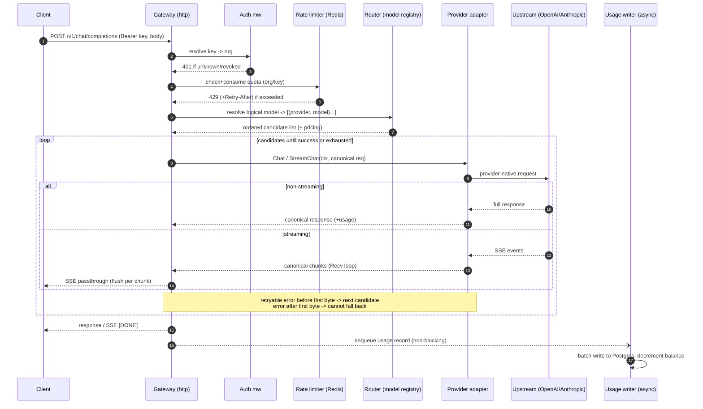

# relaygw — Design (Phase 0)

Status: **draft for review**. No code yet. This document is written from first principles and the providers' own public API documentation. Where a wire-format detail must be exact before implementation, it is flagged **[verify]** — those get re-checked against live provider docs before Phase 2.

Reference-use boundary: the existing `llmgateway` (TypeScript) project is consulted at the behavior/spec level only. None of its source was read to produce this design.

---

## 1. The problem

**Unified OpenAI-compatible surface.** Clients already speak the OpenAI `/v1/chat/completions` dialect (SDKs, tools, libraries). The gateway presents that one dialect as its public contract so any OpenAI-compatible client works unchanged, regardless of which upstream actually serves the request. The OpenAI request/response shape is therefore our *canonical internal representation*, not just our public API.

**Provider fan-out.** Behind the single surface, requests are dispatched to heterogeneous upstreams (OpenAI, Anthropic, Google, …) whose wire formats differ. Each provider is an adapter that translates canonical → provider on the way in and provider → canonical on the way out. Adding a provider is additive: implement the interface, register it. No core rewrite.

**Streaming.** Chat responses are typically streamed token-by-token over SSE. This is the latency-critical, correctness-sensitive path: bytes must be flushed promptly, client disconnects must cancel the upstream call, and an upstream error *mid-stream* must be surfaced without corrupting the stream. Streaming is designed in from the start, not bolted on.

**Auth.** Every request carries a bearer API key. The gateway resolves the key (by hash) to an organization, rejecting unknown/revoked keys before any upstream work. Provider credentials (our keys to OpenAI/Anthropic/…) are a separate concern, encrypted at rest and never logged.

**Metering.** For each completed request the gateway records prompt/completion token counts, computed cost, latency, model, and status. Recording must never block or slow the response path — it is buffered and written asynchronously. Aggregations answer "usage per org / per model / per day".

**Billing.** Metered cost decrements an org's balance (prepaid model — see §6). Low balance triggers cutoff; statements/invoices summarize a period. The payment processor itself is stubbed behind an interface — the gateway never handles live payment secrets.

---

## 2. Request lifecycle

Trace of a single `POST /v1/chat/completions`:



Key invariant: **fallback is only possible before the first response byte reaches the client.** Once we've flushed a streamed chunk, a mid-stream upstream failure cannot be transparently retried on another provider — we can only terminate the stream with an error event. This constraint shapes the router (see §5).

---

## 3. The `Provider` interface

Everything inside the gateway speaks the canonical (OpenAI-shaped) types. Routing resolves the logical model name to a concrete `(provider, providerModelID)` *before* the adapter is called, so the adapter receives a request whose `Model` is already the provider's own id.

```go
// Canonical (OpenAI-shaped) request/response types — the internal lingua franca.
type ChatRequest struct {
    Model       string    // provider-native model id (router already resolved it)
    Messages    []Message
    MaxTokens   *int      // optional for us; required for some providers (Anthropic)
    Temperature *float64
    Stream      bool
    // tools, response_format, etc. added in later phases
}

type Message struct {
    Role    string // "system" | "user" | "assistant"
    Content string // multimodal parts added later
}

type ChatResponse struct {
    ID      string
    Model   string
    Choices []Choice
    Usage   Usage
}

type Choice struct {
    Index        int
    Message      Message
    FinishReason string // canonical: "stop" | "length" | "tool_calls" | ...
}

type Usage struct {
    PromptTokens     int
    CompletionTokens int
    TotalTokens      int
}

// Provider is implemented once per upstream. Additive: register a new one, no core change.
type Provider interface {
    Name() string
    Chat(ctx context.Context, req *ChatRequest) (*ChatResponse, error)
    StreamChat(ctx context.Context, req *ChatRequest) (ChatStream, error)
}

// ChatStream is a pull-based iterator over canonical chunks.
// Recv returns io.EOF exactly once, after the final chunk.
type ChatStream interface {
    Recv() (*ChatChunk, error) // io.EOF at clean end; other error on upstream/parse failure
    Close() error              // idempotent; releases the upstream connection
}

type ChatChunk struct {
    ID      string
    Model   string
    Delta   Delta   // incremental content for one choice
    Usage   *Usage  // usually only on the final chunk, if the provider reports it
}
```

**Why a pull iterator (`Recv`) rather than a `<-chan *ChatChunk`?** A channel needs a *second* channel (or a sentinel) to carry the terminal error, and cancellation/backpressure become awkward. `Recv() (*ChatChunk, error)` maps cleanly onto both providers' SSE readers, propagates the terminal error in-band, returns `io.EOF` for a clean end, and honors `ctx` cancellation by unblocking the read. `Close()` guarantees the upstream HTTP body is drained/closed even if the client disconnects early.

### How OpenAI satisfies it

OpenAI's `POST /v1/chat/completions` **is** essentially our canonical shape, so translation is near-identity.
- **Non-streaming:** marshal canonical → OpenAI JSON (near passthrough), POST, unmarshal the response, copy `usage`.
- **Streaming:** OpenAI streams SSE lines `data: {chunk}\n\n`, terminated by a literal `data: [DONE]`. Each chunk carries `choices[].delta.content`. `usage` is only included in the final chunk when the request sets `stream_options: {"include_usage": true}` — the adapter sets this so we can meter streamed calls without a tokenizer. **[verify]** the exact `stream_options`/`[DONE]` sentinel behavior against current OpenAI docs.

### How Anthropic satisfies it

Anthropic's `POST /v1/messages` differs meaningfully; the adapter does real translation.
- **Request in:** the `system` message is lifted out of `messages` into a top-level `system` field; `max_tokens` is **required** by Anthropic, so the adapter supplies a default when the client omitted it; roles map `user`/`assistant` (Anthropic has no `system` role inside `messages`). **[verify]** required-field list and default.
- **Response out:** Anthropic returns content blocks + a `stop_reason` that maps to our canonical `finish_reason` (`end_turn`→`stop`, `max_tokens`→`length`, …), and `usage` as `input_tokens`/`output_tokens` → our `prompt`/`completion`.
- **Streaming:** Anthropic emits a **typed event stream** — `message_start`, `content_block_start`, `content_block_delta`, `content_block_stop`, `message_delta`, `message_stop` (plus `ping`). The adapter is a small state machine: `message_start` gives the id + input-token usage; each `content_block_delta` yields a canonical content delta; `message_delta` carries `stop_reason` and output-token usage; `message_stop` ends the stream. It synthesizes canonical `ChatChunk`s so the HTTP layer emits an OpenAI-shaped SSE stream regardless of upstream. **[verify]** the full event-name set and the field carrying incremental text before Phase 2.

The HTTP layer never sees provider differences: it always writes canonical chunks out as OpenAI-style SSE.

---

## 4. Data model

PostgreSQL. All ids are UUIDs; timestamps are `timestamptz`. Soft-delete via `revoked_at`/`deactivated_at` rather than hard deletes where history matters.

| Table | Key columns | Notes / relationships |
|---|---|---|
| `organizations` | `id`, `name`, `created_at` | Top-level tenant. Owns everything below. |
| `users` | `id`, `org_id → organizations`, `email` (unique), `password_hash`, `created_at` | v1: a user belongs to one org. Multi-org membership deferred (§6). Dashboard login only — **not** the request path. |
| `api_keys` | `id`, `org_id → organizations`, `name`, `key_hash` (unique), `key_prefix`, `last_used_at`, `created_at`, `revoked_at` | Bearer keys for the gateway. Store only the hash (see §6 for algorithm). `key_prefix` (e.g. `rlg_live_ab12…`) is shown in the UI so a key is identifiable without revealing it. |
| `provider_credentials` | `id`, `org_id → organizations` (nullable for system-wide), `provider`, `ciphertext` (bytea), `nonce` (bytea), `key_version`, `created_at`, `revoked_at` | Our upstream keys, AES-GCM encrypted at rest. Per-org (BYOK) or system-wide. Never logged. `key_version` supports key rotation. |
| `models` | `id`, `logical_name`, `provider`, `provider_model_id`, `input_price_per_token`, `output_price_per_token`, `active`, `created_at` | The registry: logical name → concrete provider model + pricing. One logical name may have multiple rows (fallback candidates / cross-provider equivalents). |
| `usage_records` | `id`, `org_id`, `api_key_id`, `logical_model`, `provider`, `prompt_tokens`, `completion_tokens`, `cost`, `latency_ms`, `status`, `created_at` | Append-only. Written async (§Phase 5). Source of all analytics. Indexed on `(org_id, created_at)` and `(org_id, logical_model, created_at)`. |
| `balances` | `org_id → organizations` (PK), `amount`, `updated_at` | Prepaid balance per org (§6). Decremented from usage. Money stored as an exact integer of the smallest unit (e.g. micro-USD) — never float. |
| `invoices` | `id`, `org_id`, `period_start`, `period_end`, `amount`, `status`, `created_at` | Period statements. `status` ∈ open/paid/void. |

Relationships: `organizations` 1—* {`users`, `api_keys`, `provider_credentials`, `usage_records`, `invoices`}, and 1—1 `balances`. `models` is global (org-independent) in v1; per-org overrides are a later concern.

Money is always an exact integer (micro-USD) to avoid float drift in billing math.

---

## 5. Routing & fallback

**Registry.** On startup (and periodically / on change) the router loads `models` into an in-memory map: `logical_name → []Route{provider, providerModelID, pricing}`, ordered by preference. Reads are hot-path, so this is cached; the DB is the source of truth.

**Resolution.** A request for logical model `"gpt-4o"` resolves to its ordered candidate list. The first candidate is the primary; the rest are fallbacks (which may be the *same* model on a different provider, or a designated equivalent).

**Fallback rules.**
- Retry to the *next candidate* only on **retryable** upstream failures: connection error, timeout, HTTP 5xx, 429 from the upstream (distinct from our own rate limit).
- **Non-retryable** failures (400 invalid request, 401/403 auth, content policy) short-circuit and return immediately — trying another provider won't help and wastes latency/quota.
- **Streaming caveat (from §2):** fallback is attempted only *before the first byte is flushed*. The adapter's `StreamChat` establishes the upstream connection and reads the first event before the HTTP layer commits to streaming; a failure up to that point can still fall back, after it cannot.

**Circuit breaking.** Per `(provider)` (optionally per `(provider, model)`), track recent failures. After N consecutive failures within a window the breaker **opens** — candidates for that provider are skipped for a cooldown, failing fast instead of paying the timeout every request. After cooldown it goes **half-open**: one trial request decides whether to close (recover) or re-open. Prevents a dead provider from dragging latency on every call.

**Retry-within-provider.** For an idempotent transient error we may retry the *same* candidate a small bounded number of times with backoff before moving on — again, only pre-first-byte.

**Rate limiting** (per key / per org) is enforced *before* routing, in Redis, so an over-quota request never reaches an upstream. Algorithm choice is in §6.

---

## 6. Open questions / tradeoffs (want decisions)

1. **Billing: prepaid vs postpaid — recommend _prepaid balance_.** For a self-hostable gateway, prepaid is simpler and safer: no credit risk, no dunning, a natural hard cutoff when the balance hits zero, and decrement-on-usage is easy to reason about. Postpaid needs credit limits, collections, and trust. Recommend prepaid for v1; postpaid is a later add. (This is the Phase 6 decision, surfaced early.)

2. **API-key hashing — I want to push back on argon2/bcrypt.** Those are *password* KDFs, deliberately slow to resist brute force on *low-entropy* secrets. Our API keys are *high-entropy* random tokens (e.g. 256 bits), so brute-forcing the hash is already infeasible and a slow KDF just adds latency to *every* authenticated request. Recommend a single fast hash — **HMAC-SHA-256 with a server-side pepper** (or plain SHA-256) — indexed for O(1) lookup by hash. Keep bcrypt/argon2 for the *dashboard user passwords* (`users.password_hash`), which are low-entropy and logged-into interactively. So: **two different algorithms for two different secret types.** Want your sign-off since the Phase 3 prompt says argon2/bcrypt.

3. **Token counting when the provider doesn't report usage.** Both target providers *can* report usage (OpenAI via `stream_options.include_usage`; Anthropic in stream events), so we should rarely need a fallback. Where one is missing, options: (a) a tokenizer library to estimate, accepting approximation error for non-OpenAI tokenizers; (b) record `null` tokens and skip cost for that record; (c) refuse to stream without usage. Recommend (a) with the count flagged `estimated=true` so billing/analytics can distinguish. Decision wanted on whether estimated tokens may bill.

4. **Rate-limit algorithm — recommend token bucket in Redis via a Lua script** (atomic check-and-consume, smooth bursts, cheap). Alternative: fixed/sliding window counters (simpler, but bursty at window edges). Either returns `429` + `Retry-After`/`X-RateLimit-*` headers.

5. **Provider-credential encryption key management.** v1: a 32-byte AES-GCM key from env (`ENCRYPTION_KEY`), with `key_version` stored per row to allow rotation. Later: pull from KMS. Confirm env-key is acceptable for v1.

6. **Multi-org membership.** v1 ties a user to one org (simplest). A `memberships` join table (user ↔ org, with role) generalizes it later. OK to defer?

7. **Model registry source of truth — DB vs static config file.** DB (chosen above) allows runtime changes without redeploy and per-org overrides later; a static file is simpler and version-controlled but needs a redeploy to change pricing/routes. Recommend DB, seeded from a checked-in config. Confirm.

8. **Cross-provider fallback equivalence.** For "same model, different provider" fallback to be *correct*, someone must declare two `(provider, model)` rows equivalent for a logical name. Recommend: fallback only within explicitly-configured candidate lists (no automatic "similar model" guessing). Confirm.

---

## Phase map (for reference)

0. **This doc** — design & spec. ← review checkpoint
1. Skeleton + config + graceful shutdown + `Provider` iface + OpenAI non-streaming + one hardcoded route.
2. Streaming (OpenAI SSE) + Anthropic (non-streaming + streaming, translated).
3. Postgres schema/migrations + hashed API keys + auth mw + encrypted provider creds + admin CRUD.
4. Model registry from DB + routing/fallback + circuit breaking + Redis rate limiting.
5. Async usage metering + cost tracking + `/v1/usage`.
6. Prepaid billing + dashboard JSON API + stubbed payment interface.
7. Decoupled dashboard frontend.
8. Hardening: load test streaming, timeouts/ctx everywhere, security pass, README.
